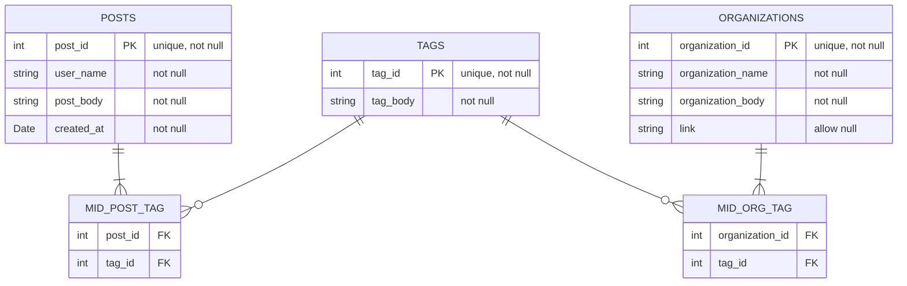

```mermaid
---
board
---
erDiagram
    POSTS ||--|{ MID_POST_TAG : ""
    POSTS {
        int post_id PK "unique, not null"
        string user_name "not null"
        string post_body "not null"
        Date created_at "not null"
    }
    TAGS ||--o{ MID_POST_TAG : ""
    TAGS {
        int tag_id PK "unique, not null"
        string tag_body "not null"
    }
    MID_POST_TAG {
        int post_id FK
        int tag_id FK
    }
    ORGANIZATIONS ||--|{ MID_ORG_TAG : ""
    TAGS ||--o{ MID_ORG_TAG : ""
    ORGANIZATIONS {
        int organization_id PK "unique, not null"
        string organization_name "not null"
        string organization_body "not null"
        string link "allow null"
    }
    MID_ORG_TAG {
        int organization_id FK
        int tag_id FK
    }

```